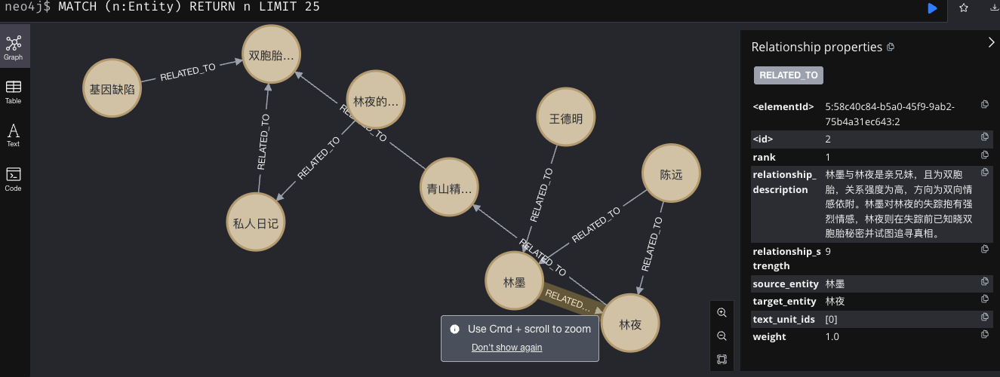

## 项目介绍
尝试复现graphrag

## 技术栈
- 模型调用：基于langchain，配置了ollama/openai
- 图数据库：neo4j
- 向量数据库：chroma

## 环境配置
- 安装依赖
```bash
pip install -r requirements.txt
```
- 配置环境变量
```bash
cp .env.example .env
vim .env
# 填写openai的api_key
# 填写openai的api_base
# 填写ollama的api
```

## 项目结构
```bash
├── .env   # 环境变量配置
└── settings   
    ├── schema.py   # 数据 schema 定义
    ├── llm.py      # LLM 配置
    └── config.py  # 环境变量配置
└── utils   
    └── graphDB.py      # 图数据库操作
└── test    
    ├── example.txt # 测试用例 , llm写的小说
    ├── test_graphdb.ipynb  # 测试图数据库调用
    └── test_extract.ipynb  # 测试提取实体关系，存入数据库
└── readme.md
```

## graphrag标准流程

文本分块 - 将文档切分为文本单元
图提取 - 提取实体和关系
图增强 - 社区检测
社区摘要 - 生成报告
文本嵌入 - 向量化处理
查询处理 - 实现搜索功能


## 项目进度

- [✅] 环境配置

- [✅] 图数据库调用，包括节点、关系的定义(settings/schema.py)

- [✅] LLM提取实体关系，存入neo4j

	- 

- [ ] 知识图谱增强

	- [ ] 层次化聚类
	- [ ] 实体融合

- [ ] 构建text-embedding

	- [ ] node、edge
	- [ ] community

- [ ] 构建查询、建图的接口

	- [ ] global、local

	
